<<<<<<< .mine
#Jenkins+gradle+svn+windows自动化编译、上传svn#
	最近公司业务需求比较少，空闲下来。把之前搭建jenkins分享给大家，Jenkins可以从svn上面拉取代码到本地上编译生成apk文件，再
	自动上传到svn，并可以自动发出邮件给相关人员。虽然网上也有很多关于这方面的资料。但是这篇文章有网上没有的
**apk注入svn源码路径、版本号、jenkins build号** 
**apk注入svn源码路径、版本号、jenkins build号** 
**apk注入svn源码路径、版本号、jenkins build号** 
## 需求介绍 ##
	1.由于公司开发需求，研发人员给测试人员发出svn源码路径、svn版本号，测试人员构建自动化打包、
	编译apk文件自动上传到svn上。
	2.为了追溯线上问题，apk文件需要注入编译svn源码路径、版本号以及jenkins build号。
## 搭建 ##
	1.Jenkins下载地址：https://jenkins.io/download/，里面有两个安装版本：LTS(稳定版本)和Weekly(开发版本)，Weekly版本每周
	2.都会更新的，我们选择LTS的，避免以后使用中出现问题。
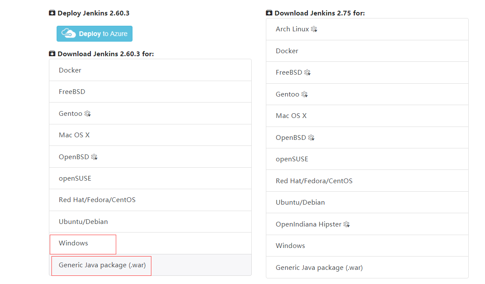 
	3.点击windows版或者.war，windows启动时通过dos命令行方式启动的，而war包是可以通过tomcat服务器启动的 
	4.将下载的jenkins.war放到Tomcat下的webapps目录下，然后启动Tomcat。在浏览器中访问"Tomcat访问地址/jenkins"即可安装，因为
	我的Tomcat装在本机，并且端口为8080，所以访问http://localhost:8080/jenkins/即可进行安装。
## 插件安装 ##
	1.点击系统管理，再点击插件管理，本项目代码管理工具为svn,安装需为svn、gradle、Build Environment Plugin（apk可以拿到构建的环境变量）、
	Build With Parameters（编译时可以注入一些动态的参数）
## 新建Job ##

### 参数化构建 ###
	1.点击新建、输入项目名称、选择一个自由风格的、最后点击ok,一个job建构成功。
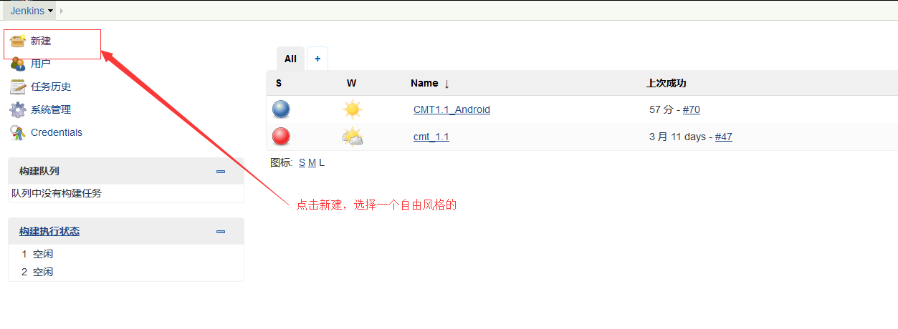 
	2.点击项目名称（例如CMT1.1_Android）,然后再点击项目配置。
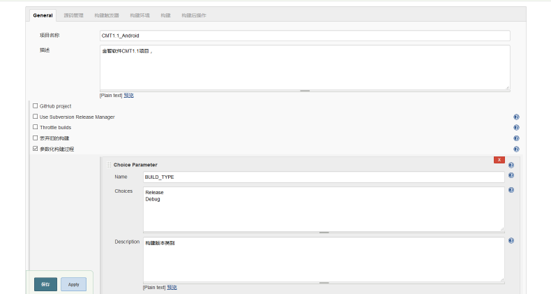 
	3.如果没有看到参数化构建过程，可能是你的插件没有安装。BUILD_TYPE是指打包的类型为debug与release,我们在build.gradle文件中
	可以获取这个值，根据值的类型，输入包的名字也不一样，release需要配置签名信息。后面我会把build.gradle文件贴出。
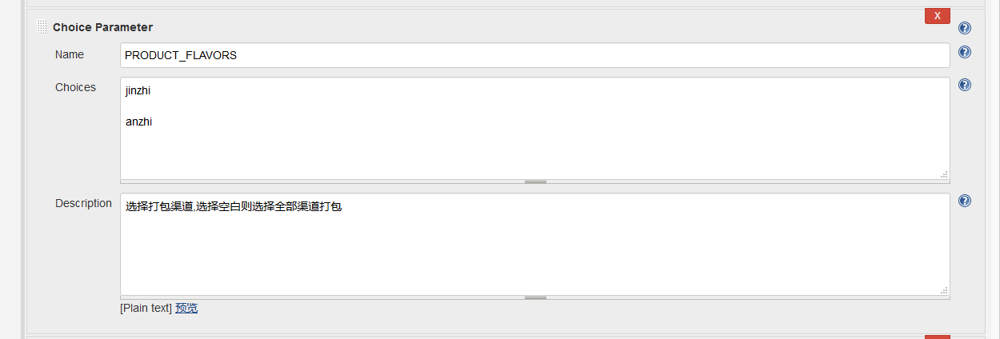 
	4.上面配置的是打包的渠道，选择控制则是多渠道打包。
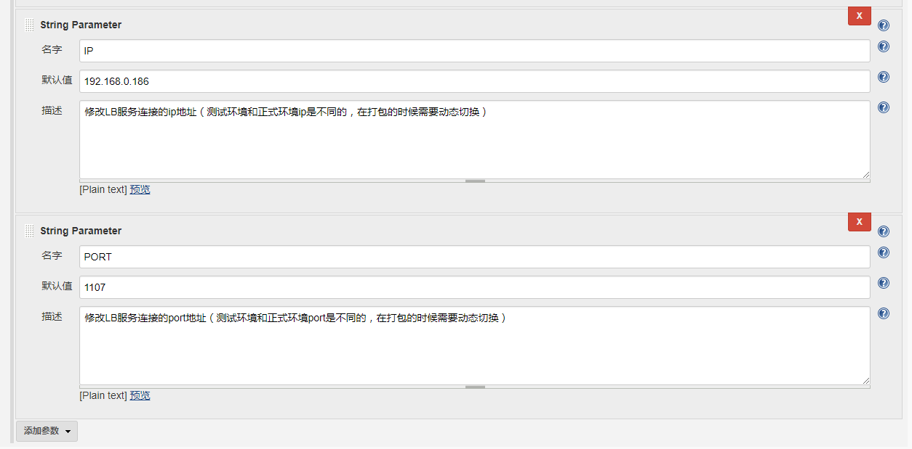 
	5.项目开发环境ip、port和测试环境、正式环境ip及port都是不一样的，可以让测试人员动态去修改项目中的ip、port。
### 源码管理 ###
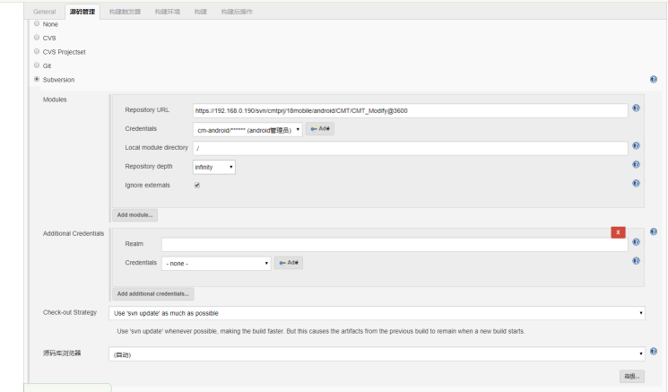 
	1.配置源码路径、Credentials就是配置源码svn账户，为空则点击add
### 构建 ###
	1.构建下面、我们点击增加构建步骤，因为Android我们选择gradle脚本编译，选择invoke Gradle script,如下图显示。
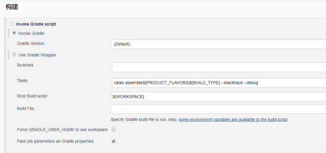 
### Execute Windows batch command###
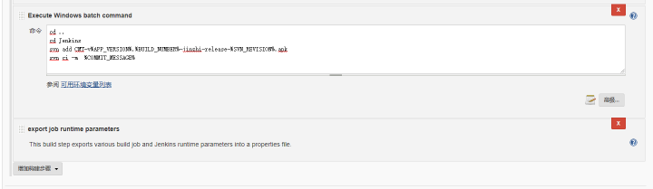 
>我改变apk文件输出路径，切换目录，然后使用windows command进行上传apk文件。
### 构建后操作 ###
	1.构建后操作主要是发出邮件通知
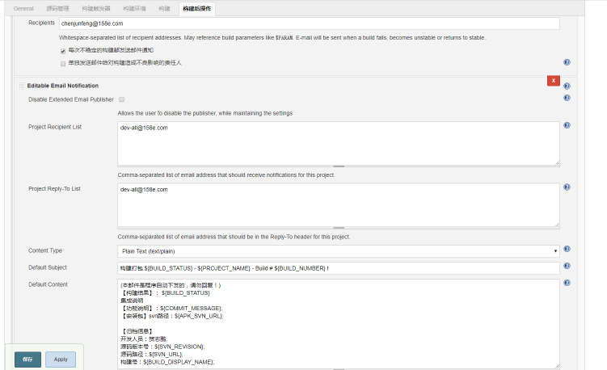 
>以上的操作说明可能不是很详细，网上说的已经比较详细，可以自行google,公司项目Jenkins配置是一台虚拟机，而编译机又是另外一台虚拟机，
>如果是有这样的需求，那你需要配置节点，配置好节点就如同jenkins是在你那台的虚拟机上编译的
### 节点配置 ###
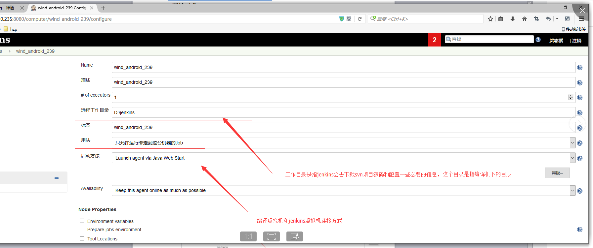 
可以参考这个大神节点配置：[http://www.cnblogs.com/juddhu/p/3198191.html](http://www.cnblogs.com/juddhu/p/3198191.html)
	1.进入需要控制的远程机器上，一定要进入远程的slave编译机器，而不是你的master jenkins机器。输入对应的你的jenkins的地址 
 
>出现如上图示，则表明连接成功。
## 构建参数化注入 ##
	-刚刚上面提到了构建参数化，打包编译时参数怎么注入到项目中来了，在项目中最外层的gradle.properties中进行注入。如图所示：
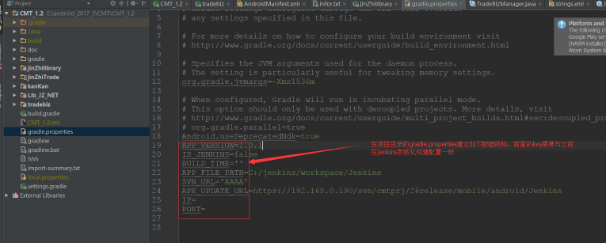 
>然后我们具体怎么取到这些值，在app项目中的build.gradle文件中获取：
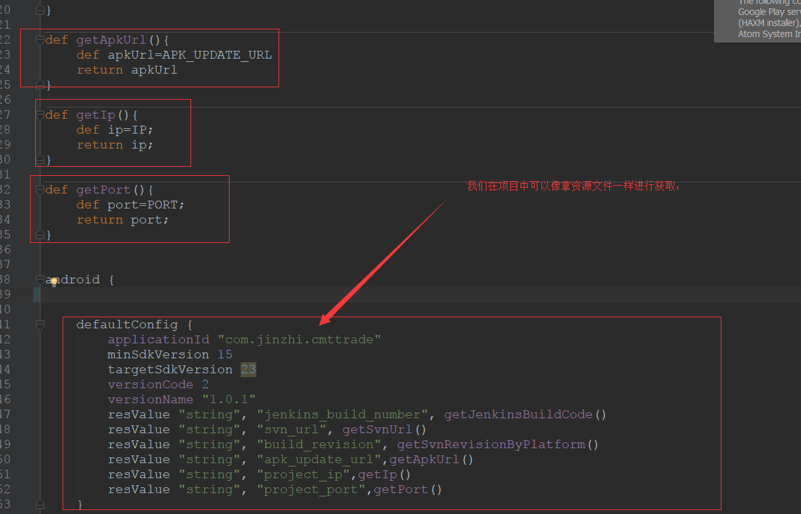 
    整个build.gradle文件代码如下： 
    `apply plugin: 'com.android.application'

    apply plugin: 'com.jakewharton.butterknife'

	def getDate() {
    def date = new Date()
    def formattedDate = date.format('yyyy-MM-dd_HH-mm')
    return formattedDate
	}

	def getApkUrl(){
    def apkUrl=APK_UPDATE_URL
    return apkUrl
	}

	def getIp(){
    def ip=IP;
    return ip;
	}

	def getPort(){
    def port=PORT;
    return port;
	}

	android {

    lintOptions {
        abortOnError false
    }
    compileSdkVersion 23
    buildToolsVersion "24.0.3"
    //签名
    signingConfigs {
        releaseConfig {
            storeFile file("micropayment.jks")
            storePassword ""
            keyAlias ""
            keyPassword ""
        }
    }

    defaultConfig {
        applicationId "com.jinzhi.cmttrade"
        minSdkVersion 15
        targetSdkVersion 23
        versionCode 2
        versionName "1.0.1"
        resValue "string", "jenkins_build_number", getJenkinsBuildCode()
        resValue "string", "svn_url", getSvnUrl()
        resValue "string", "build_revision", getSvnRevisionByPlatform()
        resValue "string", "apk_update_url",getApkUrl()
        resValue "string", "project_ip",getIp()
        resValue "string", "project_port",getPort()
    }

    //修改生成的apk名字及输出文件夹
    applicationVariants.all { variant ->
        variant.outputs.each { output ->
            //新名字
            def newName
            //时间戳
            def timeNow
            //输出文件夹
            def outDirectory
            //是否为Jenkins打包，输出路径不同
            if ("true".equals(IS_JENKINS)) {
                //Jenkins打包输出到服务器路径
                timeNow = getDate()
                BUILD_TIME = getDate()
                System.getenv();
                //BUILD_PATH为服务器输出路径
		//    outDirectory = output.outputFile.getParent()
                outDirectory = APP_FILE_PATH
                //AutoBuildTest-v1.0.1-xiaomi-release.apk
                newName = 'GCE-v' + APP_VERSION+ '.' + getJenkinsBuildCode() + '-' + variant.productFlavors[0].name + '-' + variant.buildType.name + '-'  + getSvnRevisionByPlatform() +'.apk'
            } else {
                //本机打包输出在本机路径
                timeNow = getDate()
                outDirectory = output.outputFile.getParent()
		//    outDirectory = APP_FILE_PATH
                if ('debug'.equals(variant.buildType.name)) {
                    newName = "GCE-v${APP_VERSION}-debug.apk"
                } else {
                    //AutoBuildTest-v1.0.1-xiaomi-release.apk
                    newName = 'GCE-v' + APP_VERSION + '-' + variant.productFlavors[0].name + '-' + variant.buildType.name + '-' + timeNow + '.apk'
                }
            }
            output.outputFile = new File(outDirectory, newName)
        }
    }

    buildTypes {
        release {
            minifyEnabled false        //启用代码混淆
            proguardFiles 'proguard.cfg'
            signingConfig signingConfigs.releaseConfig
        }

    }
    // 友盟多渠道打包
    productFlavors {
        huawei {}
        yingyongbao {}
        jiuyi_helper {}
        baidu_helper {}
        c360 {}
        anzhi {}
        tianyi {}
        yingyonghui {}
        liqu {}
        youyi {}
        mumayi {}
        sougou {}
        jifen {}
        wandoujia {}
        jinzhi {}
    }

    productFlavors.all { flavor ->
        flavor.manifestPlaceholders = [UMENG_CHANNEL_VALUE: name]
    }

	}

	dependencies {
    compile project(':jinZhilibrary')
    compile files('libs/dexposedbridge.jar')
    compile files('libs/libammsdk.jar')
    compile files('libs/patchloader.jar')
    compile files('libs/testinagent.jar')
    compile 'com.umeng.analytics:analytics:latest.integration'
    compile 'com.jakewharton:butterknife:8.5.1'
    annotationProcessor 'com.jakewharton:butterknife-compiler:8.5.1'
	}

	/**
	 * 判断是否有jenkins
 	* @return
 	*/
	boolean isInJenkins() {
    Map<String, String> map = System.getenv()

    if (map == null) {
        return true
    }
    String str = map.get("Path")
    if (str != null) {
        //it's windows
        return true;
    } else {
        str = ""
        Iterator iterator = map.iterator();
        while (iterator.hasNext()) {
            str += iterator.next();
        }
        if (str.contains("jenkins")) {
            return true
        } else {
            return true;
        }
    }
    return false
	}
	/**
 	* 获取svn版本号
 	* @return
 	*/
	def getSvnRevision() {
    new ByteArrayOutputStream().withStream { os ->
        def result = exec {
            executable = 'svn'
            args = ['info']
            standardOutput = os
        }
        def outputAsString = os.toString()
        def matchLastChangedRev = outputAsString =~ /Last Changed Rev: (\d+)/

        ext.svnRev = "${matchLastChangedRev[0][1]}".toInteger()
    }
    return svnRev
	}
	/**
 	* 根据不同平台来获取版本号
 	*/
	def getSvnRevisionByPlatform() {
    boolean flag = isInJenkins();
    if (flag) {
        ext.env = System.getenv()
        ext.svnNum = env.SVN_REVISION?.toInteger()
        return "$svnNum"
    } else {
        return getSvnRevision()
    }
	}
	/**
 	* 根据不同平台来获取版本号
 	*/
	def getSvnUrl() {
    boolean flag = isInJenkins();
    if (flag) {
        ext.env = System.getenv()
        ext.svnNum = env.SVN_URL?.toString()
        return "$svnNum"
    } else {
        return getSvnRevision()
    }
	}
	/**
 	* 获取Jenkins Build 号
 	* @return
 	*/
	def getJenkinsBuildCode() {
    boolean flag = isInJenkins();
    if (flag) {
        ext.env = System.getenv()
        ext.buildNumber = env.BUILD_NUMBER?.toInteger()
        return "$buildNumber"
    } else {
        return 0
    }
	}
`
## 总结 ##
	1.以上gradle脚本获取可以动态获取jenkins构建的参数，指定apk文件输出路径。项目在关于界面，连续点击五次，可以显示项目svn源码路径，
	svn版本号以及jenkins build号。
	2.第一次写博客。给个star行不行？？？
=======
# Jenkins+gradle+svn+windows自动化编译、上传svn #
Jenkins+android+gradle+svn构建项目自动化打包、编译及上传到svn.由于公司开发需求，研发人员给测试人员发出svn源码路径、svn版本号，测试人员构建自动化打包、
编译apk文件自动上传到svn上。
Jenkins每次打包的build号、打包源码svn路径、版本号需要自动注入到apk文件。方便线上出现了bug,可以及时追溯源码路径。
if  you have any issue,send email to zippsun@126.com,thanks.
# 开发背景 #
	最近公司业务需求比较少，空闲下来。把之前搭建jenkins分享给大家，虽然网上也有很多关于这方面的资料。但是这篇文章有网上没有的
	**apk注入svn源码路径、版本号、jenkins build号**
## 需求介绍 ##
	1.由于公司开发需求，研发人员给测试人员发出svn源码路径、svn版本号，测试人员构建自动化打包、
	编译apk文件自动上传到svn上。
	2.为了追溯线上问题，apk文件需要注入编译svn源码路径、版本号以及jenkins build号。
## 搭建 ##
	*Jenkins下载地址：https://jenkins.io/download/，里面有两个安装版本：LTS(稳定版本)和Weekly(开发版本)，Weekly版本每周
	*都会更新的，我们选择LTS的，避免以后使用中出现问题。

 
	*点击windows版或者.war，windows启动时通过dos命令行方式启动的，而war包是可以通过tomcat服务器启动的
>>>>>>> .r7
